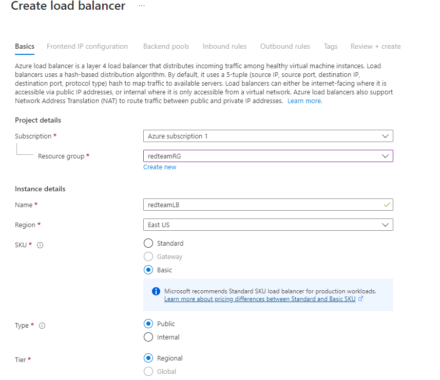
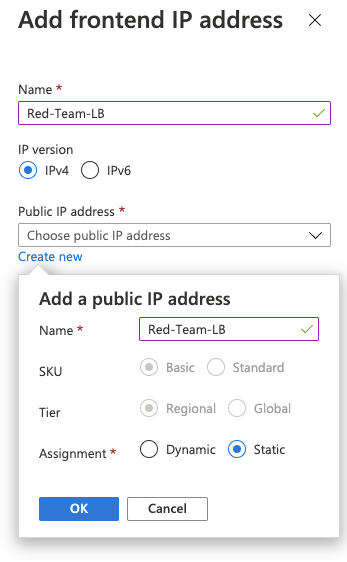
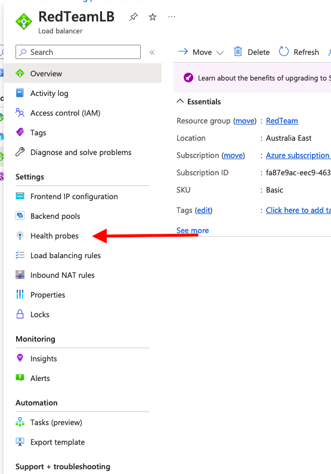
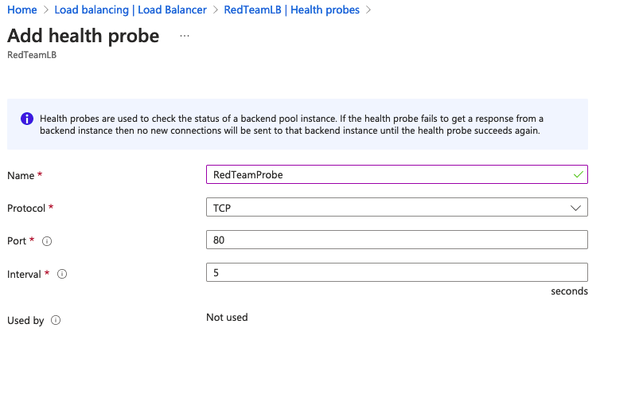

## 13.3 Lesson Plan: Load Balancing 

### Class Overview

Today's class will introduce students to the concepts of load balancing in the cloud.

### Class Objectives

By the end of class, students should be able to:

- Write Ansible playbooks to configure VMs.

- Create a load balancer on the Azure platform.

- Create firewall and load balancer rules to allow traffic to the correct virtual machines.

### Instructor Notes

Make sure that you are using your personal Azure account for the lab demonstrations and activities.

Today's demonstrations and activities include the following:

- A demonstration and activity on load balancing.

- A demonstration and activity on firewall and load balancing rule creation, which exposes students' VMs to the web.

- A demonstration and activity on adding a new VM to the backend pool of the load balancer.

- Testing and verifying the load balancing setup.

### Lab Environment 

<details><summary>Lab Details</summary>
<br>

For demonstrations, activities, and reviews, you will use your free Azure account.

- [Azure Setup Guide](https://docs.google.com/document/d/1gs_09b7eotl7hzTL82xlqPt-OwOd0aWA78qcQxtMr6Y/edit)

- [Azure Free Tier FAQs](https://azure.microsoft.com/en-us/free/free-account-faq/)

### Lab References

- [Ansible](https://ansible.com)
- [Docker](https://docker.com)
- [YAML](https://yaml.org/spec/1.2/spec.html#Introduction)

</details>

### Slideshow

The slides for today can be viewed on Google Drive here: [13.3 Slides](https://docs.google.com/presentation/d/1A0vwOnMe6k2ANHCgw69XJFn_TD9l5dBA23ToKmiO6lM/).

- To add slides to the student-facing repository, download the slides as a PDF by navigating to File > "Download as" and choose "PDF document." Then, add the PDF file to your class repository along with other necessary files.

- **Note:** Editing access is not available for these documents. If you or your students wish to modify the slides, please create a copy by navigating to File > "Make a copy..."

### Time Tracker

The time tracker for today's lesson can be viewed on Google Drive here: [13.3 Time Tracker](https://docs.google.com/spreadsheets/d/1D-rEaPZXDy-9Ly9LHGakfGXP0gJdBRHAiSXFw8u7Udo/edit#gid=1047115118).

### Student Guide

At the end of class, be sure to send out the student-facing version of the lesson plan: [13.3 Student Guide](StudentGuide.md).

---

### 01. Instructor Do: Welcome (0:05)

Welcome the students to class and provide a quick overview of today's curriculum:

- Implementing provisioners 

- Creating a load balancer to distribute web traffic across different servers

- Configuring new firewall rules to allow HTTP traffic into a VNet

|:warning: **CHECKPOINT** :warning:|
|:-:|
| Using the [Daily Checklist](../Resources/Checklist.md), verify that students have completed all Day 2 critical tasks and are ready to continue to today's activities. |

At the end of Day 2, students should have completed:

- [ ] Docker is installed and running on the jump box.

- [ ] The `cyberxsecurity/ansible` Docker container is running on the jump box.

- [ ] The security group has a rule that allows the jump box SSH access to the VNet.

- [ ] An SSH key created from inside the Ansible container that has no password.

- [ ] The Web VMs password has been reset using the SSH key from the Ansible container.

- [ ] Ansible is able to make a connection to both Web VMs.

Failure to complete these steps will hinder the activities in today's class.

Provide some career context for the topics we'll cover today:

- **Cloud security analysts** and **cloud penetration testers** need to understand cloud architecture in order to test the security settings for a given environment.

- **Cloud architects** build out cloud environments for an organization and are expected to understand how to build in security from the ground up. 

- **DevSecOps** are responsible for maintaining production and testing environments for an organization's developer and QA testing teams. They are expected to build and maintain secure systems at every step of the development process.

### 02. Instructor Do: Ansible Playbooks (0:15)

Remind class that our cloud design so far includes a jump box that is running an Ansible container. The Ansible container has full access to our VNet and can make a connection with our new VM.

The next step is to write some code that will be our "infrastructure as code" for the vulnerable web servers.

- Once we have our server defined with code, we will be able to quickly remove and relaunch the server if it is compromised.

Explain that Ansible reads YAML code. YAML recursively stands for "YAML ain't markup language" and is designed to be readable and easy to write.

#### YAML Walkthrough

Connect to your jump box and then to your Ansible container:

- Run `ssh [username]@[ip.of.vm]`.

- Run `sudo docker start container_name` to start your container.

  - Run `sudo docker container list -a` if you need to see your container's name.

  - Run `sudo docker ps` to view running containers.

- Run `docker attach container_name` to get a shell on your Ansible container.

- Run `cd /etc/ansible` and `ls` to see the files there.

Explain that we will now create a YAML file for Ansible to read.

- The YAML file extension is .yml.

- A YAML file is denoted with three hyphens on the first line of the file.

Point out that Ansible documentation calls these files "playbooks" because they are used to run a set of "plays" or "actions" on a server, much like an American football team would run a series of plays during a game.

- Run `nano my-playbook.yml` to create your YAML file.

- Write the following:

```YAML
---
- name: My first playbook
  hosts: webservers
  become: true
  tasks:
```

:warning: **Heads Up:** Each indentation in a YAML file is two spaces.

Break down the syntax:

- `---`: The first three hyphens denote that this is a YAML file.
- `- name`: This precedes the name of the playbook.
- `hosts`: This precedes the group of servers in the hosts file that we will run actions on.
- `become: true`: This line means that all actions will be run as root on the server we are configuring. We must run items with root so we can install software and make system changes.
- `tasks`: This is where we specify what actions we want to take. Everything listed under `tasks` will run one at a time.

Ask the students if there are any questions.

Once we have these first five lines written, we can start defining what tasks we want to take.

Explain that Ansible has extensive documentation on how to accomplish almost anything. Each action that we'd want to take has an Ansible "module" with many options.

- Ansible documentation can be found at [docs.ansible.com](https://docs.ansible.com/). Googling will often find the page faster.

Open Google and type "Ansible apt module."

- You should easily find this page: [docs.ansible.com/ansible/latest/modules/apt_module.html](https://docs.ansible.com/ansible/latest/modules/apt_module.html).

- This page is the Ansible documentation for the `builtin.apt` module. This module lets us install applications on a Linux server just as we would with the `apt` command.

- Once on the page, scroll to the **Parameters** section and explain that these are all the different options we can use with the `apt` module.

- Scroll further down to the **Examples** section to see very specific examples of how to install applications using this module. We can copy and paste these examples and make a few modifications.

Copy the first example for installing Apache and paste it into your playbook.

```YAML
---
- name: My first playbook
  hosts: webservers
  become: true
  tasks:

  - name: Install apache httpd  (state=present is optional)
    ansible.builtin.apt:
      update_cache: yes
      name: apache2
      state: present
```

Break down the syntax:

- Each task will start with a hyphen (`-`) placed at the same indentation as `tasks`.
- `- name`: This precedes the name of the task. We can give the task any name, but since we will see this name in Ansible's output when we run the playbook, it should be a name we will recognize.
- `ansible.builtin.apt`: The name of the module we are using. It is at the same indentation level as the `name` specification.
- `update_cache: yes`: This runs the equivalent of `sudo apt update` to pull the most recent repositories.
- `name`: The next `name` precedes the name of the package we want to install. Here, it is `apache2`. This field is indented two spaces from the start of `apt`.
- `state`: This precedes the state of the package we want to install, which is either `present` or `absent`. 
  - If set to `present`, Ansible checks to see if the package is there. If it is there, Ansible does nothing. If it is not there, Ansible runs the command `sudo apt install apache2` to install Apache2. 
  - If set to `absent`, Ansible checks for the package and runs `sudo apt remove apache2` if Apache2 is there. 

We now have a completed playbook. 

- We can run this playbook on our server and it will install Apache2.

Save and close your playbook file. 

To run an Ansible playbook, we only need the command `ansible-playbook` and the name of the playbook. 

- Run `ansible-playbook my-playbook.yml`.


  ```bash
  root@1f08425a2967:~# ansible-playbook my-playbook.yml

  PLAY [My first playbook] ***************************************************************

  TASK [Gathering Facts] *************************************************************************
  ok: [10.0.0.6]

  TASK [Install apache httpd  (state=present is optional)] *******************************************************************************

  changed: [10.0.0.6]

  PLAY RECAP *************************************************************************************
  10.0.0.6                   : ok=1    changed=1    unreachable=0    failed=0    skipped=0    rescued=0    ignored=0   
  ```

Point out that we get a detailed output of each task that Ansible has completed. It tells us the name of our playbook and the name of the tasks that we created.

Remind students that there are Ansible modules for almost anything we can think of. For example: 

[label](.)- Create files and folders.

- Start, stop, and download Docker containers.

- Change system settings.

- Download code from Github.

- Create compressed archives of files.

Ask students if they have any questions about creating a playbook or the YAML syntax.

Explain that during the next activity, they will need to use the following modules:

- `builtin.apt`, found at [docs.ansible.com/ansible/latest/modules/apt_module.html](https://docs.ansible.com/ansible/latest/modules/apt_module.html).

- `pip`, found at [docs.ansible.com/ansible/latest/modules/pip_module.html](https://docs.ansible.com/ansible/latest/modules/pip_module.html).

- `docker-container`, found at [docs.ansible.com/ansible/latest/modules/docker_container_module.html](https://docs.ansible.com/ansible/latest/modules/docker_container_module.html).

Point out that each page has an Examples section that they can copy from.

### 03. Student Do: Ansible Playbooks Activity (0:25)

Explain the following to students:

- In previous classes, you created a secure network and connection to a VM that is used as a jump box to configure other machines on the Red Team network. 

- In this activity, you will use Ansible to configure the VM and install Docker, as well as the web application you will use for testing and training.

- You are tasked with creating an Ansible playbook that installs Docker and configures a VM with the DVWA web app.

Send students the following files:

- [Activity File: Ansible Playbooks](Activities/03_Ansible_Playbooks/Unsolved/README.md)

- [Ansible Playbook Example](Activities/03_Ansible_Playbooks/Unsolved/playbook_example.yml)

### 04. Instructor Review: Ansible Playbooks Activity (0:15)

:bar_chart: Run a comprehension check poll before reviewing the activity. 

Point out that the goal of this activity is to create an Ansible playbook that installs Docker and a DVWA container. Once students have this "infrastructure as code" file, they can run it on as many VMs as they want.

Use the following file to guide your walkthrough: 

- [Solution Guide: Ansible Playbook](Activities/03_Ansible_Playbooks/Solved/README.md)

The students should now have two VMs that are running a Docker DVWA container. They also have an Ansible playbook that will allow them to create a new VM running this container whenever they want.


---

|:warning: **CHECKPOINT** :warning:|
|:-:|
|At this time, students should have completed the following critical items:|
- [ ] An Ansible Playbook has been created that configures Docker and downloads a container.

- [ ] The Ansible Playbook is able to be run on the Web VMs.

- [ ] The Web VMs are both running a DVWA Docker container.

---

### 05. Instructor Do: Load Balancing (0:15)

Remind students that at this point, we have created a VNet, deployed a jump box running an Ansible Docker container, and used that container to configure another VM running a DVWA container.

- If the Red Team attacks this DVWA container with enough traffic, they may be able to trigger a Denial of Service (DoS) on the machine. 

- DoS attacks are a common problem with websites. 

Explain that one way to mitigate DoS attacks is to have multiple servers running the same website, with a **load balancer** in front of them. 

Students should be familiar with load balancers from previous modules: 

- A load balancer provides a website an external IP address that is accessed by the internet. 

- The load balancer receives any traffic that comes into the website and distributes it across multiple servers.

- As the website receives more traffic, more servers can be added to the group ("pool") of servers that the load balancer has access to. This helps distribute traffic evenly among the servers and mitigates DoS attacks.

Explain that a load balancer typically also has a **health probe** function. This function checks regularly to make sure all of the machines behind the load balancer are functioning before sending traffic to them. Machines with issues are reported and the load balancers stop sending traffic to those machines.

Point out that this system can still be overwhelmed with traffic and taken down, but it is much more resilient than if a single server was running the website.

Remind students that the DVWA VM they set up is intentionally not accessible from the internet at this time. The next step is to set up a load balancer with an external IP and point it to the VM.

- Open your Azure portal and search for "load balancer."

- Point out that we can add the load balancer with the same **+ Create** button that exists on other pages in the Azure portal. 

- Select the relevant resource group.

- Provide a name for your load balancer.

- For Type, select Public.

- For SKU, select Basic.

- For Tier, select Regional.



- Select `Next: Frontend IP Configuration` for the Public IP address setting.

- Select `+ Add a frontend IP`.

- Give the public IP a name.

	- Note that this name is used to create a URL that maps to the IP address of the load balancer. Because of that, it **must** be a unique name across all of Azure.

	- Look for the green check mark to determine if the name will work.

- Choose `IPv4` for IP version.

- Under `Choose public IP address`, click on `Create new`.

- Add the same name for the `Name` Field.

- Choose `Static` for the `Assignment` option.

- Click OK.

- Click `Add`.

	

- Click on `Next: Backend pools >`.

- Click on `Add a backend pool`.

- Create a backend pool name like `Red-Team-Backend-Pool`.

- Choose your Red Team VNet.

- Click `Add` to select your virtual machines.

- Add both `Web-1` and `Web-2` machines.

  

- Emphasize to students that both VMs should be added to the **backend pool**.

- Click `Save`.

- Skip the `Inbound rules` and `Outbound rules` sections.

- Click **Review + create** and confirm.

Explain to students that balancing machines require a `health probe` to determine if each machine is healthy.

- Configure the Health Probe.

- Start by going to the load balancer you just create.
- On the left, select Health Probes.



- Click Add to create a health probe.
  - Give it a unique name 
  - Set Protocol to `TCP` and Port to `80`
  - Set Interval to `5` seconds



Students should now have a load balancer set up with a public IP and both VMs in the backend pool.

Students should follow the activity instructions to complete the setup.

### 06. Student Do: Load Balancing Activity (0:20)

Explain the following to students:

- Previously, you created a jump box on a secure VNet that you can use to run Ansible and configure other machines. You also used this jump box to configure another machine and set up DVWA for the Red Team to use.

- In this activity, you will continue with this setup of DVWA. It needs to be accessible from the internet and we want to make sure it has high availability and some redundancy. 

- At this time, if the VM receives too much traffic from the Red Team, the server may stop responding (Denial of Service).

- You must install a load balancer in front of the VM to distribute the traffic across more than one VM.

:globe_with_meridians: Students should stay in the same **breakout room** groups as the previous activity.

Send students the following file:

- [Activity File: Load Balancing](Activities/06_Load_Balancing/Unsolved/README.md)

### 07. Instructor Review: Load Balancing Activity (0:15)

:bar_chart: Run a comprehension check poll before reviewing the activity. 

Point out that in this activity, we want to setup a load balancer with a public IP address to receive web traffic.

Use the following file to guide your walkthrough:

- [Solution File: Load Balancing](../3/Activities/06_Load_Balancing/Solved/README.md)


### 08. Break (0:15)

### 09. Instructor Do: Firewall Configuration (0:15)

Explain that now that we have a load balancer running, we want to make sure it is configured properly to allow traffic to the VM backend pool.

- The security group will need to be configured to allow web traffic into the VNet from the load balancer.

- Students already know how to create a security group rule, so you won't go over that again.

By the end of the next activity, students should finally be able to reach the DVWA website from the internet.

- Open your Azure portal and explain that you will demonstrate how to create a load balancing rule.

- Open your load balancer details page and click on **Load balancing rules** on the left side.

:warning: **Heads Up:** If you get an error saying a backend pool must exist first, wait a minute and try again.

Point out that students will see the same **+ Add** button that they have used for all other resources.

- Click the **+ Add** button.

- Load balances work by forwarding traffic from specific ports to the backend pool of machines on specific ports. This rule will specify which ports can receive traffic.

Point out that students should choose the backend pool and health probe that they created in the previous activity.

Explain that if a student is unsure if they need a specific option, they can hover their mouse over the small **i in a circle** next to the title of the option to learn more about that option.

- Hover your mouse over the **i** next to **Session persistence** to show the text that pops up.

   

Explain that every time students create a rule, they should evaluate each option to determine if they need it.

:warning: **Heads Up:** A common mistake is to create VM's that are not in the same availability set. If the VMs are not in the same availability set, they cannot be added to the same backend pool. The VMs will need to be deleted and created again in the correct availability set following the Solutions from Day 1 [HERE](../1/Activities/12_Virtual_Computing/Solved/README.md).

### 10. Student Do: Security Configuration (0:20)

Explain the following to students:

- Previously, you configured a DVWA VM from your jump box VM and placed it behind a load balancer. At this time, you still cannot access the DVWA site.

- In this activity, you will continue with the setup of this training environment and allow DVWA to be reached from your home IP address.

- Your task is to configure the load balancer and security group to work together to expose port `80` of the VM of your Home IP address.

Send students the following file:

- [Activity File: Security Configuration](Activities/09_Security_Configuration/Unsolved/README.md)

### 11. Instructor Review: Security Configuration  (0:15)

:bar_chart: Run a comprehension check poll before reviewing the activity. 

Explain that the goal of this activity was to expose port `80` so that we can load the DVWA site over the internet.

Use the following file to guide your walkthrough:

- [Solution Guide: Security Configuration](Activities/09_Security_Configuration/Solved/README.md)

---

|:warning: **CHECKPOINT** :warning:|
|:-:|
| At this time, students should have completed the following critical items:|

- [ ] A load balancer has been created and both Web VMs have been placed behind it.

- [ ] The Deny All rule has been removed from the Security Group to allow traffic from the load balancer.

- [ ] The DVWA site is able to be accessed through the load balancer from the internet.


---

:warning: **Heads Up:** All of a student's VMs should be using the same network security group. If, by accident, some VMs have their own network security group, students will need to add rules for each one to allow traffic on port 80.

|:warning: **CHECKPOINT** :warning:|
|:-:|
| Use the [Daily Checklist](../Resources/Checklist.md) to verify that students are ready for the next class session. |

At the end of Day 3, students should have completed the following critical items:

- [ ] An Ansible playbook has been created that configures Docker and downloads a container.

- [ ] The Ansible playbook can be run on the web VMs.

- [ ] The web VMs are running a DVWA Docker container.

- [ ] A load balancer has been created and at least two web VMs placed behind it.

- [ ] The DVWA site can be accessed through the load balancer from the internet.

Failure to complete these steps will hinder the activities in the next class.

---

© 2023 edX Boot Camps LLC. Confidential and Proprietary. All Rights Reserved. 
