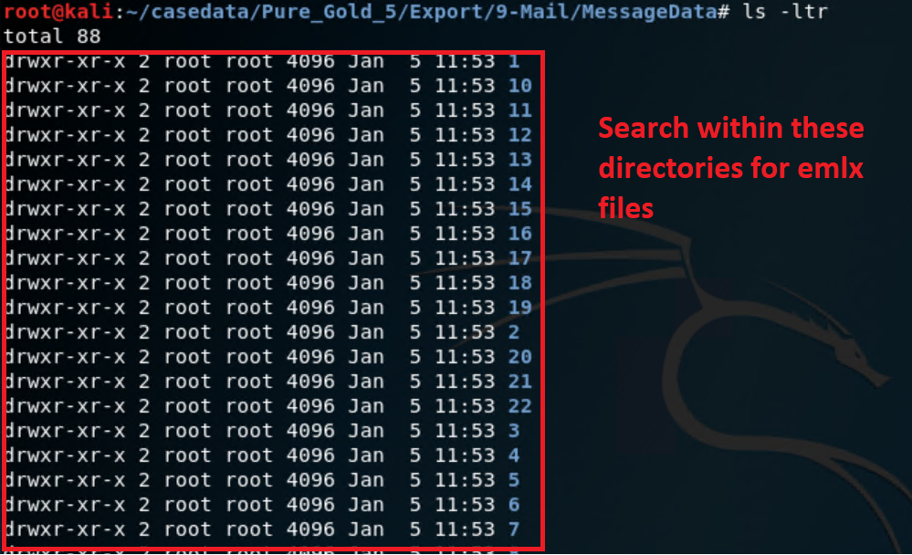
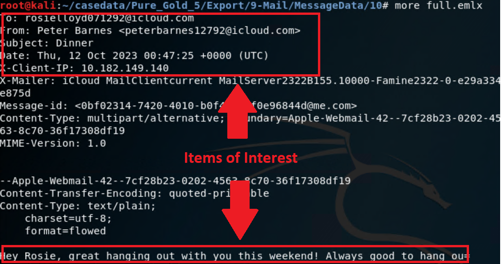
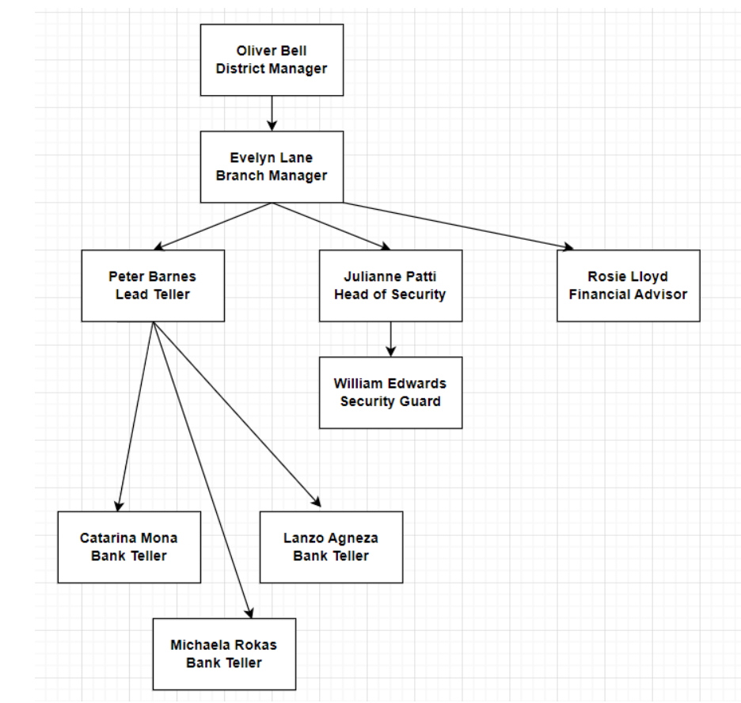
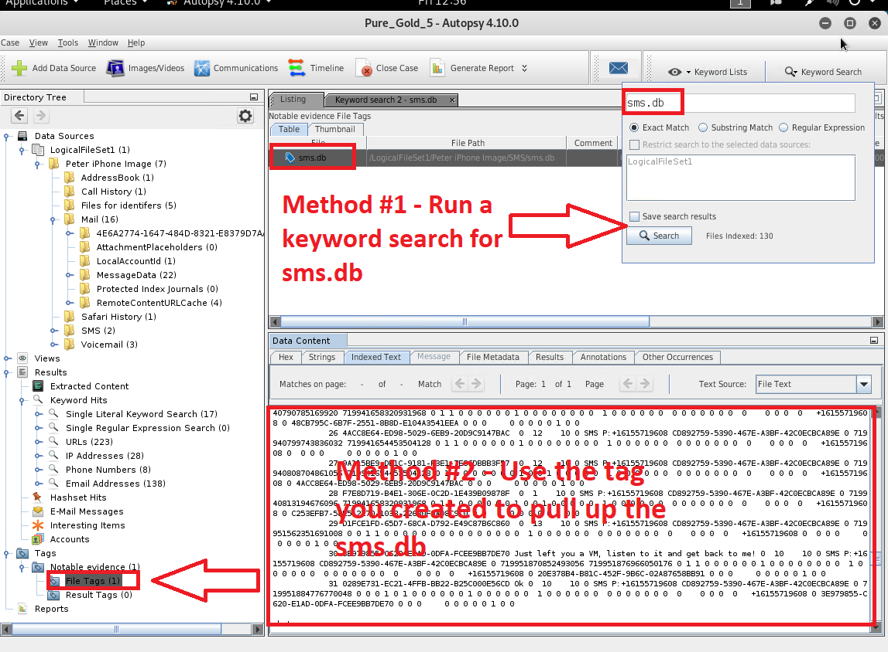
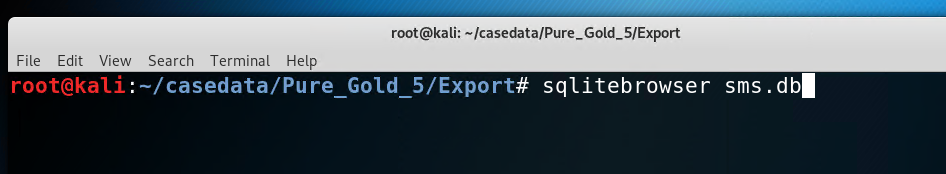
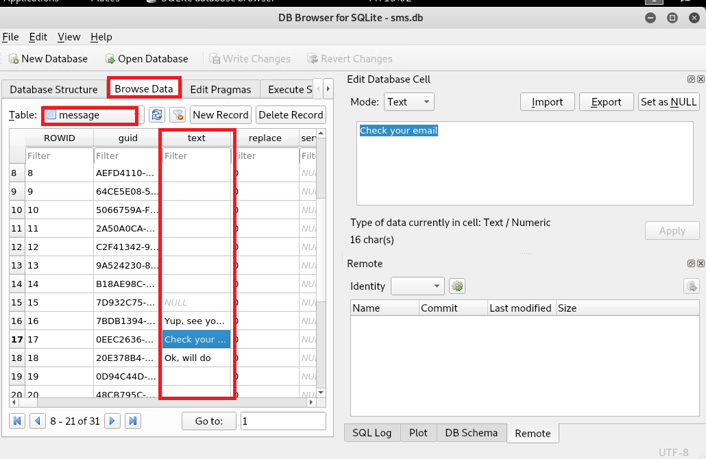
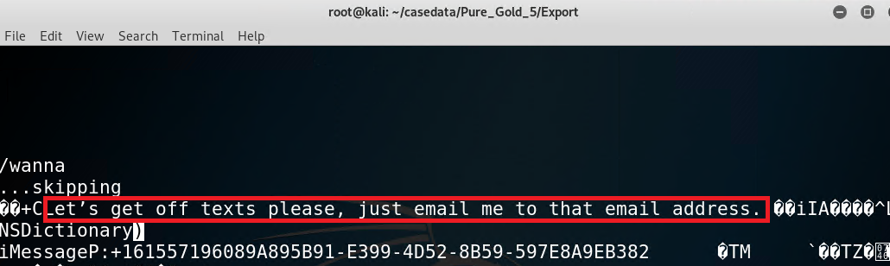

## 21.3 Student Guide: Evidence Acquisition and Reports

### Class Overview

Today we will conclude our introduction to digital forensics. Students will continue the investigation of Peter's iPhone by examining emails and text messages. They will also produce a preliminary log and report on the evidence found.

### Class Objectives

By the end of class, you will be able to:

- Use Autopsy to view and gather evidence from Peter's emails.
- Use data exports to analyze email messages offline.
- Use data exports to analyze SMS messages offline.
- Use Autopsy to extract GPS data and identify WiFi locations.
- Prepare a preliminary report using evidence worksheets.

### Lab Environment

Lab Details

 

In this module, you will use the Forensics lab environment located in Windows Azure Lab Services. RDP into the **Windows RDP host machine** using the following credentials:

  - Username: `azadmin`
  - Password: `p@ssw0rdp@ssw0rd`

Open Hyper-V Manager to access the nested machine:

**Kali Forensics machine:**
  - Username: `root`
  - Password: `toor`

  

### Slideshow

- Slides for today's lesson can be found on Google Slides: [21.3 Slides](https://docs.google.com/presentation/d/1QL_9ibOkLD45skt6i_qzIHvYMClwgaKb1wWIeEDqqYo/edit#slide=id.g480f0dd0a7_0_1803).

----

### 01. Instructor Do: Welcome and Overview (0:05)

Welcome to the third day of the digital forensics module. Here is what we covered in the last class:

- Identifying methods used in smartphone forensics.
- Examining databases and file structures of an iPhone directory image.
- Locating and documenting evidence of ownership for an iPhone image.
- Using Autopsy to view and tag evidence of an iPhone image.
- Extracting data for use in other applications (logs, text, pictures, video, audio).

Note the folloring:

- As a forensic investigator, it's critical that you understand how to use tools such as Autopsy, and how to export data so other team members can perform offline analysis of evidence.

- .emlx is a file extension called Mail Message that’s used to store email messages.

- EMLX files are often referred to as Apple Mail files because they are created with Apple's mail program to store plain text files for a single message.

### 02. Student Do: Email Export (0:15)

- In this activity, you will continue your role as a digital forensic investigator.

- Your task is to export the email database for offline analysis using examination tools outside of Autopsy.

- [Activity File: Email Export](Activities/02_Email_Export/Unsolved/README.md)

### 03. Instructor Review: Email Export Activity (0:10)

Note the following concepts:

- File exports enable database information to be easily transferred to spreadsheets or word documents, where it can be integrated into reports and analyzed by other teams.

Completing this activity requires the following steps:

- Search the directory tree to find Peter's email files.
- Perform a directory export for Peter's emails.
- Verify the export to see if the EMLX files were successfully created in the `Export` directory.

### 04. Instructor Do: Peter's Email Evidence (0:10)

We already exported Peter's emails to the `Export` directory during the warm-up activity.

Now you will use offline analysis to uncover details about the plot of the crime and possibly identify the co-conspirators and their roles.

#### Importance of Emails

You can extract critical information from emails, such as:

- Sender's email address
- Sender's IP address
- Internet Service Provider
- User client (email app)
- Location information

All of this information plays an important role in conducting a digital forensics investigation.

#### Examine Emails in Kali Linux

You will demonstrate how to display email messages in the `Mail/MessageData` folder.

- These emails were exported to the `Mail/MessageData` folder in Kali Linux during the warm-up activity.
    - *Note: There may be a small variation in the name of your "mail" folder.*

Open a terminal window and navigate into the directory that contains the `MessageData` directory.  

- Run `ls -l` to see the full contents of the `Messages` folder.

Within each of these directories contains EMLX files.

   

#### Search for items of interest

In the next activity, you will continue your investigation by using preview commands to view the contents of each EMLX file, as shown below.

   
  - You will also look at any email attachments and tag items of interest in Autopsy.

The following diagram provides a high-level overview of the threat actor's involvement in the PGCU Case.

  - You should use this as a roadmap to tie Peter's associates to each incident.

     

 Review the following worksheet:

-  The [Correspondence Evidence Worksheet](https://docs.google.com/document/d/1zS-QDGYhMnbZZrwcapIrwdn73fUoh3MSkaZCcX-7LUM/edit?usp=sharing) is used to document evidence from the communications (i.e., phone calls, emails, text messages) found on Peter's phone. Students should complete this as a group.

  - You will fill out the following information:

      - Artifact numbers to help organize records
      - Timestamp (time email was sent or received)  
      - Header information
        - These should include names of the individuals involved, their email addresses, and the email subject line.
      - Key information
        - Summary of the email contents.
      - Evidence location
        - Source of the data (For example, email, SMS, phone call, etc. )

    

### 05. Student Do: Peter's Email Evidence (0:45)

- In this activity, you will use Autopsy to view Peter's email correspondence and generate a list of contacts and their email addresses.

- You will be assigned to work in a small group as part of a digital forensic team.

- You will create custom tags for the evidence in Autopsy.

- You will also document your findings using the Correspondence Evidence Worksheet.

- Remind students that these emails were exported to the `Mail/MessageData` directory during the warm-up activity, and this is where they can perform offline analysis.

- This will be a collaborative effort. Break the class up into small groups of three or four.

Use the following files to complete the activity:

- [Activity File: Peter's Email Evidence](Activities/05_Emails/Unsolved/README.md)
- [Correspondence Evidence Worksheet](https://docs.google.com/document/d/1zS-QDGYhMnbZZrwcapIrwdn73fUoh3MSkaZCcX-7LUM/edit?usp=sharing)

### 06. Break (0:10)

### 07. Instructor Review: Peter's Email Evidence Activity (0:10)

### 08. Instructor Do: Peter's SMS Messages (0:10)

In our last activity, we were able to identify potential co-conspirators by analyzing Peter's emails.

We'll continue to search for more evidence by examining Peter's SMS messages.

- Note the following about **SMS** :

   - SMS messages are what you know as text messages. SMS stands for "short message service" and is a person-to-person communication method.

   - SMS messages can be no more than 160 characters.

   - SMS messages can and have been used in DoS attacks.

   - **Smishing** is the term used to refer to a social engineering attack performed using SMS messages.

#### Forensic Analysis of SMS Messages Demonstration

Now, you will perform a short demonstration to view the SMS entries contained in the iPhone image.

There are four methods we can use to view these entries:

**Method 1**

 1. From the **Tools** menu, select **File Search by Attribute**.

 1. Click the box next to **Name** and type `sms.db`.

 1. Click the **Search** button.

 1. Select `sms.db` from the **Listing** pane.

 1. Select the **Indexed Text** tab in the **Data Content** pane to see Peter's messages.

**Method 2**

Click the custom tag that you created earlier to load the `sms.db` file.

   - We can read this in the **Data Content** pane.

   

**Method 3**

Since this is a database file, we can also use a tool like SQLite Browser to read the messages.

  

 - Navigate to **Browse Data** and then the **message** table.

   

**Method 4**

Alternatively, we can export the file and use a preview command to read the messages.  

 

- Note that with this method, its a little more difficult to determine the messages and senders

### 09. Student Do: Peter's SMS Messages (0:15)

- In this activity, you will work with your group to examine Peter's SMS messages and gather more information about the case.

- Keep your Correspondence Evidence Worksheet updated with your findings.

- You will also export the `sms.db` file so other departments can use third-party software to perform analysis.

- [Activity File: Peter's SMS Messages](Activities/09_SMS/Unsolved/ReadMe.md)

### 10. Instructor Review: Peter's SMS Messages (0:10)

### 11. Student Do: The Final Report (0:25)

In this activity, you will conclude your investigation by working in groups to analyze their findings and prepare a final report.

- You can continue working on whatever you didn't finish at home as part of your Challenge deliverable.

- So far, you've examined quite a bit of information in the iPhone image and worked through the following steps:

  - Performed mobile forensic analysis and compiled details from Peter's iPhone.
  - Searched through numerous files and directories on the iPhone image.
  - Tagged and categorized evidence relevant to the case.
  - Created custom tags.
  - Extracted data for offline analysis using the export function.
  - Examined and documented Peter's emails.
  - Examined and documented Peter's SMS messages.

Use the following activity file and PDF document to help guide your work:

- [Activity File: Final Report](Activities/11_Final_Report/README.md)
- [Worksheet: Location Information Worksheet](https://docs.google.com/document/d/19ckQwWc2iPh7qzKVDnBAKoBS-DpVBCb2cFfAbLNrULk/edit?usp=sharing)
- [Worksheet: The Final Report](https://docs.google.com/document/d/1wUvR5F-KBDbazg4-upPxBuSPORWqMmAaYv5RXm0dWzM/edit)
- [Resource: iPhone Forensic Image - Important Files and Databases](https://docs.google.com/document/d/1MN4aTz8qsPh1SayR9LWKVNIGndLcSVrg1SPHj4NtVLs/edit)

### 12. Everybody Do: Final Report (0:15)

### 13. Instructor Do: Class Wrap-Up (0:10)

For their Challenge assignment, you will continue to work on Peter's iPhone case and produce a final report as a deliverable.

Note the following key takeaways from this lesson:

- Digital forensics is a field dedicated to identifying, extracting, preserving, and reporting information obtained from computer and network systems.

- Digital forensics relies on the expertise of examiners to analyze and interpret data retrieved by trusted forensics examination tools.

- Investigative teams may be spread across several time zones, so it's important to follow a baseline time zone as indicated by case file.

----

&copy; 2023 edX Boot Camps LLC. Confidential and Proprietary. All Rights Reserved.
